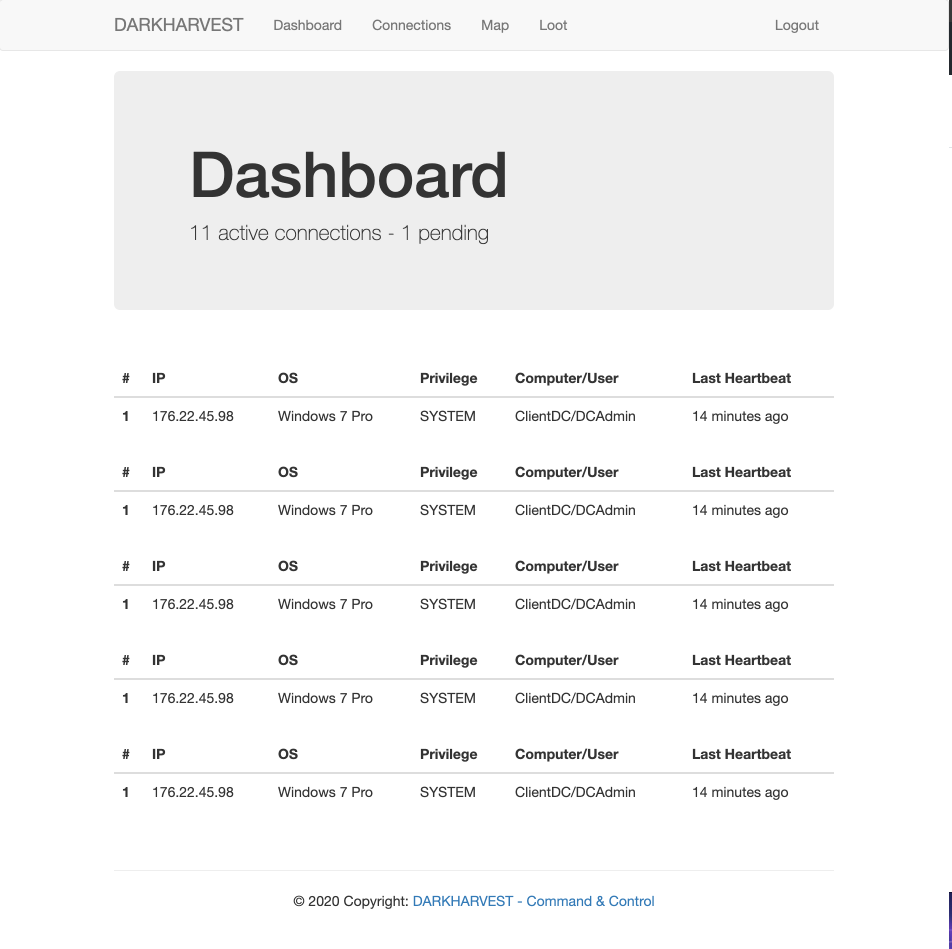

[]

# DARKHARVEST
DARKHARVEST is a work-in-progress **C2** tool meant to ease administration and cleanup on pentests.

**I don't assume any responsability for the use of this tool**

DARKHARVEST will eventually offer an interactive shell to execute commands on infected hosts.

# Disclaimer
This tool is currently not functional as intended. Authentication works via user registration.
The dashboard and interactive space requires authentication. 

Ideally, the API that will receive connections and display them will be token protected. 

Roadmap will be incorporated soon.

# Preview

# Installation
1. Fork/Clone/Download this repo

    `git clone https://github.com/l373/DARKHARVEST.git`

2. Activate a venv with the relevant command to the receiving system

3. Copy the DARKHARVEST directory into the new venv after activating.

4. Navigate to the directory

    `cd DARKHARVEST`

5. Run `pip3 install -r requirements.txt`

6.  While in the root directory, make sure the following are set:
- FLASK_APP=darkharvest.py
- FLASK_DEBUG=1

7. Flask run

** Warning ** Restart the venv after installing packages to avoid import errors.

## Usage

DARKHARVEST will eventually receive heartbeats from the post-exploitation phase, and 
display them with some interactive functionality. The hope is to parse based on a predefined
arguement. Still in the works.

# Contributing
You can propose a feature request opening an issue or a pull request.

Or just help out as you likely know more than I. :D
